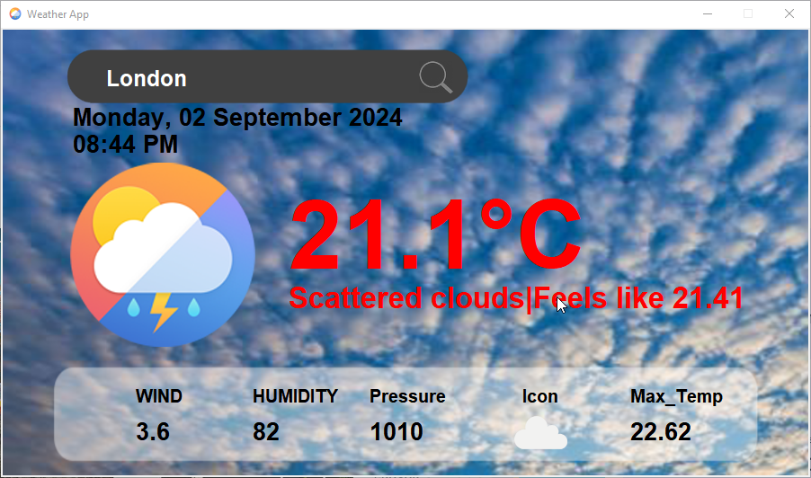
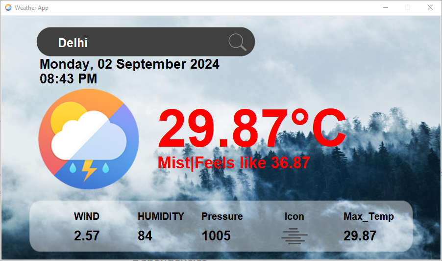
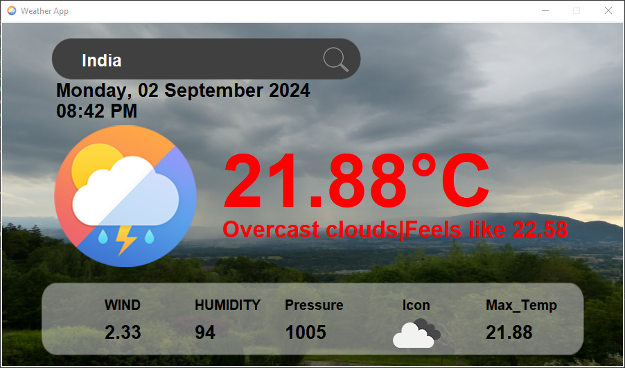
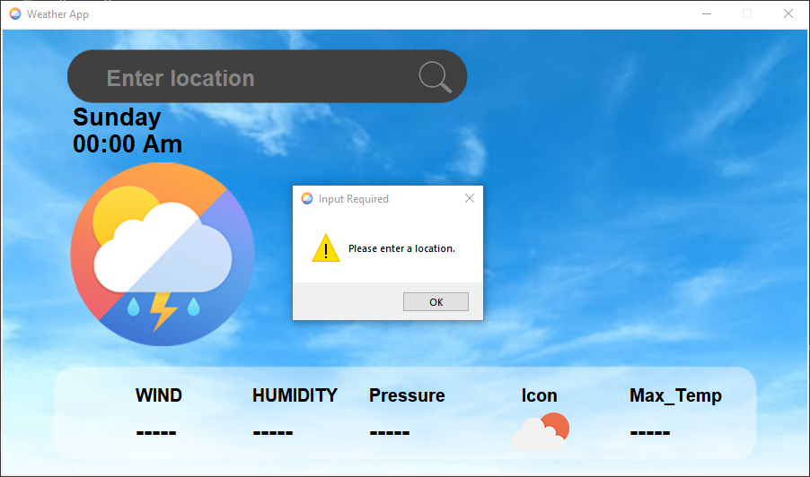

# Weather App 🌦️

 

A sleek and modern weather application built using CustomTkinter in Python. This app allows users to search for weather information by location, displaying real-time data such as temperature, wind speed, humidity, and more. The background and icons dynamically change based on weather conditions, providing an interactive user experience.

## Features

- **Real-time Weather Data**: Fetches current weather conditions from the OpenWeatherMap API.
- **Dynamic UI**: The app changes background images and icons based on weather conditions for a visually engaging experience.
- **Location Search**: Users can input any location to get precise weather information, including temperature, wind speed, humidity, pressure, and more.
- **Responsive Design**: The UI adjusts for better readability and aesthetics on various screen sizes.
- **Error Handling**: The app provides user-friendly error messages for invalid inputs, failed API requests, or missing location data.

## Installation

1. **Clone the repository**:
    ```bash
    git clone https://github.com/yourusername/weather-app.git
    cd weather-app
    ```

2. **Install the required Python libraries**:
    ```bash
    pip install -r requirements.txt
    ```
    - If you don't have a `requirements.txt`, here’s what it might include:
      ```text
      customtkinter
      requests
      geopy
      pillow
      ```

3. **Obtain an API Key**:
    - Sign up at [OpenWeatherMap](https://openweathermap.org/api) to get a free API key.
    - Replace `API_KEY` in your script with your actual API key.

4. **Run the application**:
    ```bash
    python weather.py
    ```

## Usage

1. **Search for Weather Information**: 
    - Enter the location in the search bar.
    - Press the search button to fetch and display weather details.

2. **View Weather Details**:
    - Temperature, humidity, wind speed, pressure, and more will be displayed.
    - The background and weather icon will change according to the current weather condition.

## Screenshots





## Dependencies

- **CustomTkinter**: A modern and customizable version of Tkinter.
- **Requests**: For making HTTP requests to the OpenWeatherMap API.
- **Geopy**: For fetching geographical coordinates of a location.
- **Pillow (PIL)**: For handling and displaying images in the application.


